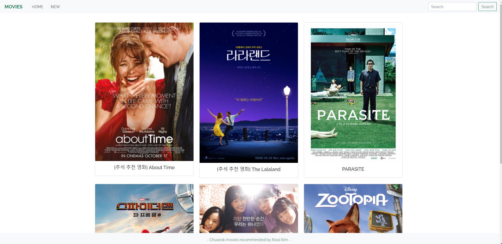
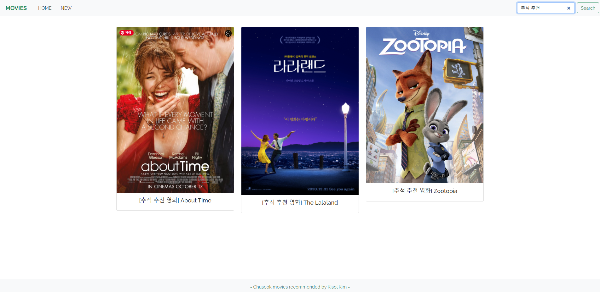
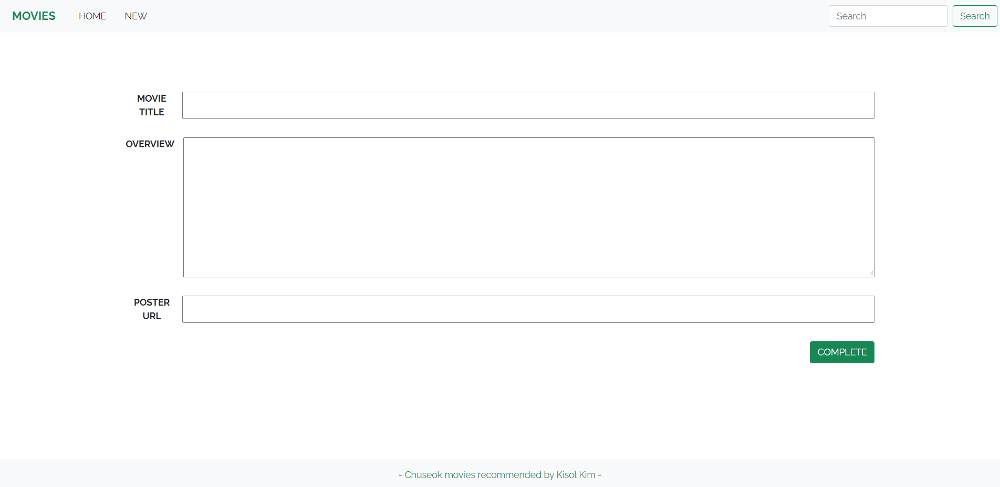
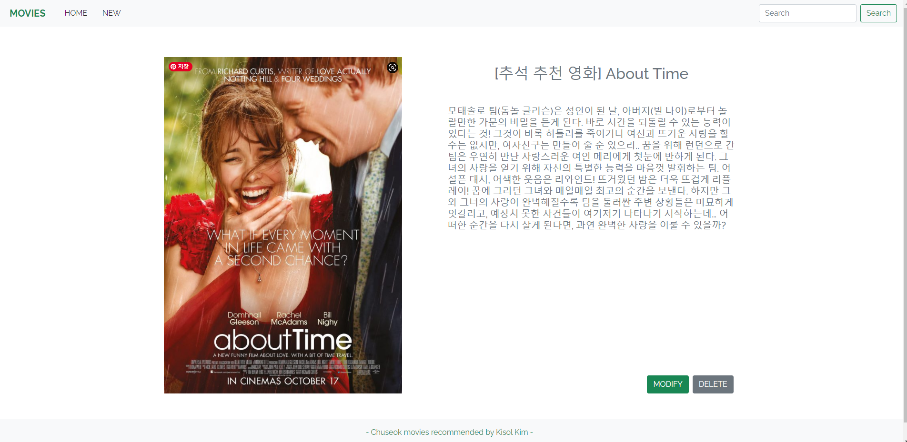
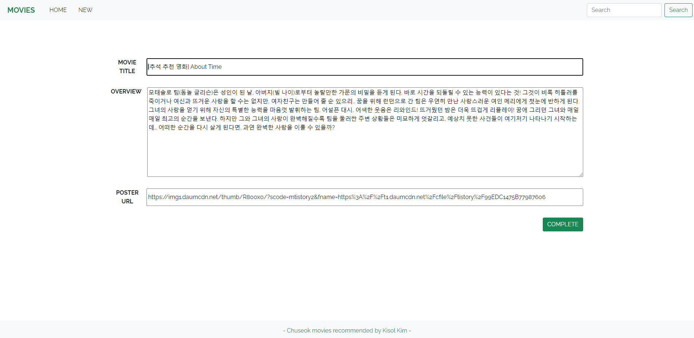

# pjt04 README


## 1. Description

 본 프로젝트는 Django를 활용하여 영화 커뮤니티 서비스 개발을 위한 프론트 화면 구현 및 CRUD의 목적을 갖습니다.


## 2. Environment

- Windows OS 활용
- Bootstrap v5
- Google Chrome Browser
- Python 3.9.6 활용
- Django


## 3. Prerequisite

- 없음


## 4. Explanation

### 1. BASE_DIR/templates/base.html

```html
<!DOCTYPE html>
<html lang="en">
<head>
    <meta charset="UTF-8">
    <meta http-equiv="X-UA-Compatible" content="IE=edge">
    <meta name="viewport" content="width=device-width, initial-scale=1.0">
    <link href="https://cdn.jsdelivr.net/npm/bootstrap@5.1.0/dist/css/bootstrap.min.css" rel="stylesheet" integrity="sha384-KyZXEAg3QhqLMpG8r+8fhAXLRk2vvoC2f3B09zVXn8CA5QIVfZOJ3BCsw2P0p/We" crossorigin="anonymous">
    <link rel="preconnect" href="https://fonts.googleapis.com">
    <link rel="preconnect" href="https://fonts.gstatic.com" crossorigin>
    <link href="https://fonts.googleapis.com/css2?family=Nanum+Gothic:wght@400;700;800&family=Raleway:ital,wght@0,100;0,200;0,300;0,400;0,500;0,600;0,700;0,800;0,900;1,100;1,200;1,300;1,400;1,500;1,600;1,700;1,800;1,900&display=swap" rel="stylesheet">
    <title>MOVIES</title>
    <style>
      * {
        font-family: 'Raleway', sans-serif;
      }
    </style>
</head>
<body>

<nav class="navbar navbar-expand-lg navbar-light bg-light fixed-top">
  <div class="container-fluid">
    <a class="navbar-brand fw-bold text-success ms-3" href="">MOVIES</a>
    <button class="navbar-toggler" type="button" data-bs-toggle="collapse" data-bs-target="#navbarSupportedContent" aria-controls="navbarSupportedContent" aria-expanded="false" aria-label="Toggle navigation">
      <span class="navbar-toggler-icon"></span>
    </button>
    <div class="collapse navbar-collapse" id="navbarSupportedContent">
      <ul class="navbar-nav me-auto mb-2 mb-lg-0">
        <li class="nav-item">
          <a class="nav-link active ms-3" aria-current="page" href="">HOME</a>
        </li>
        <li class="nav-item">
          <a class="nav-link active ms-3" aria-current="page" href="">NEW</a>
        </li>
      </ul>
      <form class="d-flex" action="" method="GET">
        <input class="form-control me-2" type="search" placeholder="Search" aria-label="Search" name="query">
        <button class="btn btn-outline-success" type="submit">Search</button>
      </form>
    </div>
  </div>
</nav>

<div class="m-5">
  
  
</div>

<footer class="d-flex justify-content-center align-items-center p-2 mb-3 text-success">
  <p class="m-2">- Web-Django PJT by Kisol Kim and Donghyun Kim -</p>
</footer>

<script src="https://cdn.jsdelivr.net/npm/bootstrap@5.1.0/dist/js/bootstrap.bundle.min.js" integrity="sha384-U1DAWAznBHeqEIlVSCgzq+c9gqGAJn5c/t99JyeKa9xxaYpSvHU5awsuZVVFIhvj" crossorigin="anonymous"></script>    
</body>

</html>
```

### 2. movies/models.py

```python
from django.db import models
from django.db import models

# Create your models here.

class Movie(models.Model):
    title = models.CharField(max_length=100)
    overview = models.TextField()
    poster_path = models.CharField(max_length=500)

    def __str__(self):
        return self.title
```

### 3. movies/admin.py

```python
from django.contrib import admin
from .models import Movie

# Register your models here.
class MovieAdmin(admin.ModelAdmin):
    display = [
        'pk',
        'title',
        'overview',
        'poster_path',
    ]

admin.site.register(Movie, MovieAdmin)
```

### 4. movies/urls.py

```python
from django.contrib import admin
from django.urls import path
from . import views

app_name = 'movies'

urlpatterns = [
    path('new/', views.new, name='new' ),
    path('create/', views.create, name='create' ),
    path('', views.index, name='index' ),
    path('<int:movie_pk>/', views.detail, name='detail' ),
    path('<int:movie_pk>/edit/', views.edit, name='edit' ),
    path('<int:movie_pk>/update/', views.update, name='update' ),
    path('<int:movie_pk>/delete/', views.delete, name='delete' ),
    path('search/', views.search, name='search' ),
]
```

### 5. movies/views.py

```python
from django.contrib import admin
from django.urls import path
from . import views

app_name = 'movies'

urlpatterns = [
    path('new/', views.new, name='new' ),
    path('create/', views.create, name='create' ),
    path('', views.index, name='index' ),
    path('<int:movie_pk>/', views.detail, name='detail' ),
    path('<int:movie_pk>/edit/', views.edit, name='edit' ),
    path('<int:movie_pk>/update/', views.update, name='update' ),
    path('<int:movie_pk>/delete/', views.delete, name='delete' ),
    path('search/', views.search, name='search' ),
]
```

### 6. movies/templates/movies/index.html





```html

 전체 목록 조회 


  <br><br>
  <section class="container">
    <div class="row row-cols-1 row-cols-sm-2 row-cols-lg-3 g-4">
      
        <article class="col">
          <div class="card">
            <a href="" class="text-decoration-none text-dark"></a>
            <div class="card-body">
              <h5 class="card-title text-center"><a href="" class="text-decoration-none text-dark">
                {{ movie.title }}
              </a></h5>
            </div>
          </div>
        </article>
      
    </div>
  </section>
  <br><br>

```

### 7. movies/templates/movies/new.html



```html

 새로운 글 작성 


    <form action="" method="POST" class="container my-5 ms-auto me-auto text-center fw-bold">
      
      <div class="d-flex flex-column" width="300px">
        <div class="my-3 d-flex">
          <label for="title" class="d-block me-2">MOVIE TITLE</label>
          <input type="text" id="title" name="title" class="d-block w-100" autofocus>
        </div>
        <div class="d-flex my-3">
          <label for="overview" class="d-block me-3">OVERVIEW</label>
          <textarea name="overview" id="overview" cols="30" rows="10" class="d-block w-100"></textarea>
        </div>
        <div class="d-flex my-3">
          <label for="poster_path" class="d-block me-2">POSTER URL</label>
          <input type="text" id="poster_path" name="poster_path" class="d-block w-100">
        </div>
      </div>
      <button class="btn btn-success my-3 d-block ms-auto">COMPLETE</button>
    </form>

```

### 8. movies/templates/movies/detail.html



```html

 세부 영화 조회 


  <div class="container w-70">
    <br>
    <div class="d-flex">
      
      <div class="d-flex flex-column m-5 justify-content-between w-100">
        <div>
          <h2 class="text-center text-secondary mt-3 mb-5">{{ movie.title }}</h2>
          <h5 class="text-secondary">{{ movie.overview }}</h5>
        </div>
        <div class="d-flex justify-content-end">
          <a href ="" class="mx-1">
            <button class="btn btn-success">
              MODIFY
            </button>
          </a>
          <form action="" method="POST" class="mx-1">
            
            <button class="btn btn-secondary">DELETE</button>
          </form>
        </div>
      </div>
    </div>
  </div>
  <br><br>

```

### 9. movies/templates/movies/edit.html



```html

 글 수정 


    <form action="" method="POST" class="container my-5 ms-auto me-auto text-center fw-bold">
      
      <div class="d-flex flex-column" width="300px">
        <div class="my-3 d-flex">
          <label for="title" class="d-block me-2">MOVIE TITLE</label>
          <input type="text" id="title" name="title" class="d-block w-100" autofocus value="{{ movie.title }}">
        </div>
        <div class="d-flex my-3">
          <label for="overview" class="d-block me-3">OVERVIEW</label>
          <textarea name="overview" id="overview" cols="30" rows="10" class="d-block w-100">{{ movie.overview }}</textarea>
        </div>
        <div class="d-flex my-3">
          <label for="poster_path" class="d-block me-2">POSTER URL</label>
          <input type="text" id="poster_path" name="poster_path" class="d-block w-100" value="{{ movie.poster_path }}">
        </div>
      </div>
      <button class="btn btn-success my-3 d-block ms-auto">COMPLETE</button>
    </form>

```

## 5. After Project

### 😊 What I Learned

- CRUD에 대한 이해
  - 서버가 동작하는 흐름 자체를 이해하고 어떻게 데이터가 저장, 수정되는지 파악하며 CRUD의 기본에 대해 익혔습니다.
  - 특히, 디버깅하는 과정에서 데이터 흐름을 차근차근 따라가다보니 문제가 풀려 뿌듯했습니다.
- pair로 협업하는 방법
  - 처음 페어로 프로젝트를 진행했었는데, 제가 놓치는 부분을 페어가 캐치해주고 페어가 놓치는 부분을 제가 캐치하며 서로 상호보완이 되어 좋았습니다.
  - 진행할 때 더 많은 생각을 나눌 수 있어서 좋았고 배웠던 부분에 대해 말로 설명하며 조금 더 확실하게 이해가 되었습니다.
- 화면 구성
  - 실제 계속 화면이 바뀌는 것을 보면서 어떻게 보면 더 사용자가 편리할 지 고민하며 발전시켜 나갔습니다.
- 새로운 기능 구현
  - 검색 기능에 대해서 수업 때 배우지 않았으나, 구글링을 통해 여러가지를 시도하며 구현해 냈습니다.

### 😂 What to Learn

- 시간 관리의 중요성
  - 디자인에 너무 신경쓰다보니 시간이 늦어 README 작성에 시간을 쏟을 수가 없어서 아쉬웠습니다 ㅠㅠ
  - 앞으로 여유있게 항상 시간을 잡고 작업을 진행할 예정입니다.